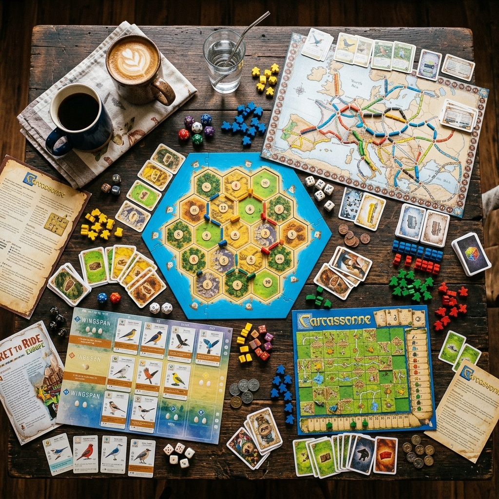
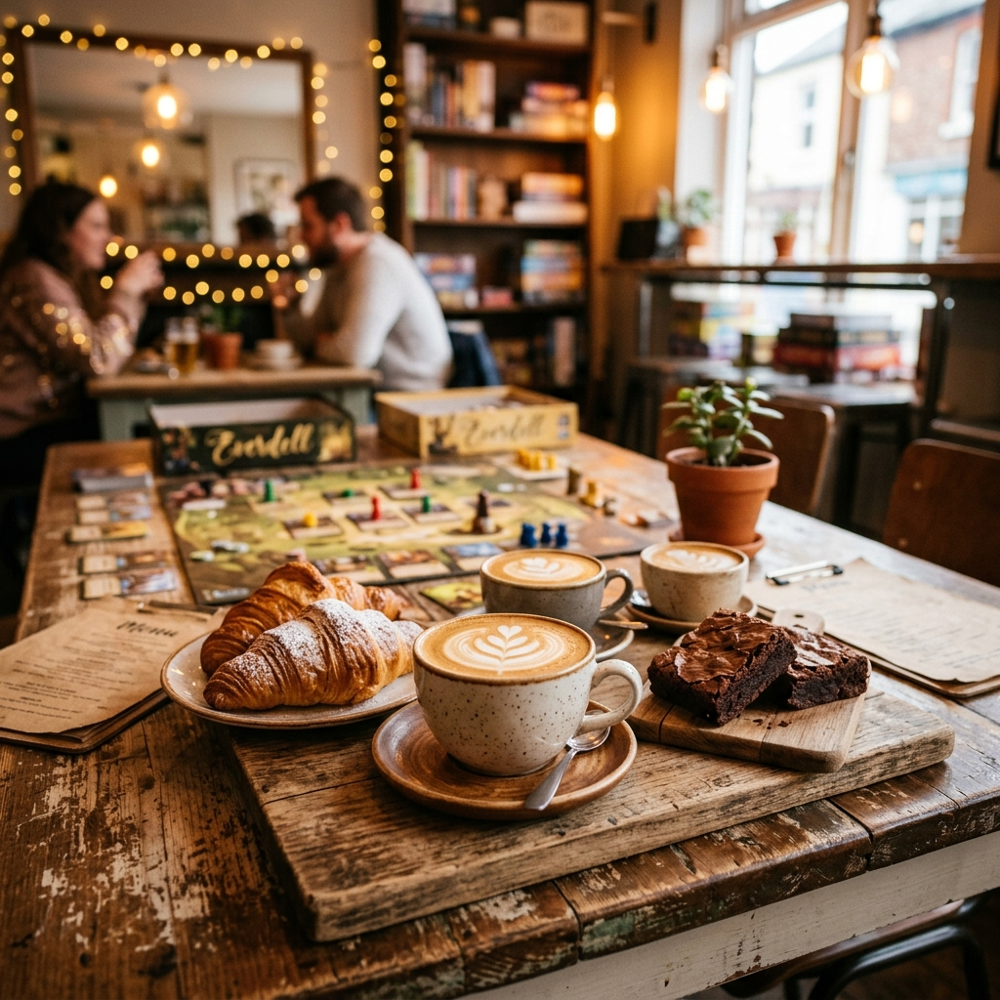
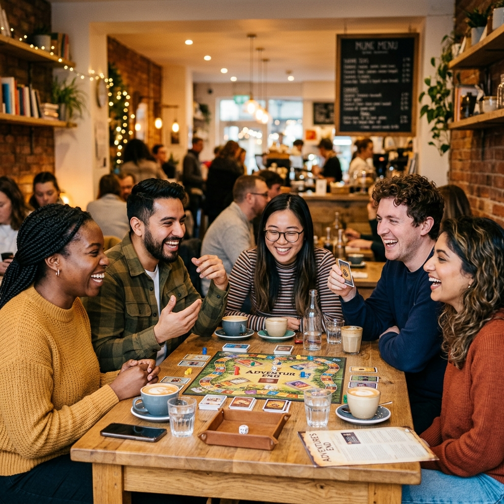

# Roll & Brew ☕🎲

## Where Great Games Meet Great Coffee

Discover our library of **500+ board games**, enjoy artisan drinks, and join a community of fellow game lovers at the coziest cafe in town.

[Reserve a Table](#visit) · [Explore Games](#games)

---

## Our Story

Born from a love of board games and great coffee, **Roll & Brew** is your home away from home. We believe the best moments happen around a table — whether you're strategizing in Catan, bluffing in Poker, or discovering a new favorite game.

| | |
|---|---|
| **500+** Games | **50+** Seats | **7** Days Open |

---

## The Roll & Brew Experience

### 🎲 500+ Game Library
From classic favorites to the latest releases, our curated collection has something for everyone — all free to play.

### ☕ Artisan Coffee & Food
Specialty coffees, hand-crafted teas, fresh pastries, and savory bites made in-house daily.

### 🎯 Game Guides on Staff
Not sure how to play? Our friendly game guides will teach you the rules and help you find your new obsession.

### 🎉 Private Events
Book our space for birthdays, team-building, or game tournaments. We handle the fun — you enjoy the party.

---

## Our Game Collection

Our shelves are packed with over **500 carefully curated board games** spanning every genre and skill level. Our game guides are always happy to recommend the perfect game for your group.

**Categories:** Strategy · Party Games · Co-op · Card Games · Family · RPGs · Trivia · Puzzle · Deck Building · Euro Games

---

## Food & Drinks Menu

From handcrafted lattes to hearty snacks, our menu is designed for long game sessions and good vibes.

| Item | Price |
|------|-------|
| ☕ Signature Latte | $5.50 |
| 🍵 Matcha Roll | $6.00 |
| 🥐 Fresh Croissant | $4.00 |
| 🍕 Game Night Pizza | $12.00 |
| 🧁 Brownie Bites | $3.50 |
| 🎲 Table Fee (All-day) | $5.00 |

---

## Upcoming Events

### 🎲 Open Board Game Night
**Every Tuesday · 7:00 PM**
Free entry! Grab a drink, pick a game, and meet new friends around the table.

### 🏆 Strategy Game Tournament
**Every Friday · 6:30 PM**
Compete in our weekly tournament series. Prizes for the top 3 players!

### 👨‍👩‍👧‍👦 Family Game Day
**Every Sunday · 2:00 PM**
Kid-friendly games, special treats, and fun for the whole family. All ages welcome!

---

## Plan Your Visit

Walk-ins welcome, reservations recommended for groups of 4+.

### Opening Hours

| Day | Hours |
|-----|-------|
| Monday | 10:00 AM – 10:00 PM |
| Tuesday | 10:00 AM – 11:00 PM |
| Wednesday | 10:00 AM – 10:00 PM |
| Thursday | 10:00 AM – 10:00 PM |
| Friday | 10:00 AM – 12:00 AM |
| Saturday | 9:00 AM – 12:00 AM |
| Sunday | 9:00 AM – 9:00 PM |

### Contact Us

- 📍 **Address:** 123 Board Street, Gametown, GT 10001
- 📞 **Phone:** +1 (555) ROLL-BREW
- ✉️ **Email:** hello@rollandbrew.com
- 📸 **Instagram:** @rollandbrew

---

*© 2026 Roll & Brew Board Game Cafe. All rights reserved.*
